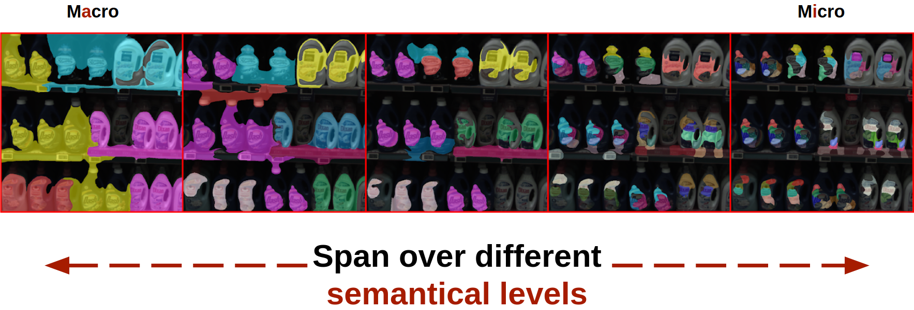

# semantic-discovery

Release code of paper _"Unsupervised semantic discovery through visual patterns detection - Pelosin F., Gasparetto A., Albarelli A., Torsello A."_ submitted to S+SSPR 2020.




# How to Run 

1. Clone this repo: 
    
    `git clone https://github.com/francesco-p/semantic-discovery`

2. Download the dataset at [this](https://drive.google.com/drive/folders/1vLC8hkjq-eNWtAh_nf0KdFItn4oA-KIy?usp=sharing) link. Extract it and move the `datasets` folder inside this cloned repo. 

    The folder structure you should have at this point is:

    ```
    .
    ├── datasets
    │   ├── img01.png
    │   ├── semantic_lvl1
    │   ├── semantic_lvl2
    │   └── ...
    ├── fig1.png
    ├── notebooks
    │   ├── 01-run.ipynb      <-- Interactive run of the method on an image
    │   └── 02-dataset.ipynb  <-- Dataset Visualization
    ├── output                <-- Output of scripts/run.py
    ├── README.md
    ├── scripts
    │   ├── fig01.png
    │   └── run.py            <-- Run the method to an image
    └── src
        ├── accumulator.py
        ├── detector.py
        ├── detector.pyc
        ├── extractor.py
        ├── metrics.py
        └── utils.py
    ```

3. Make sure you have [docker](https://www.docker.com/) installed, then run: 

    `sudo docker run --rm -it -p 8889:8889 -v /abs/path/to/this/repo:/descriptor fpelosin/semantic-discovery bash`

    Due to the opencv `xfeatures2d` module we had to use docker as reproducibility environment. 

4. We suggest to play with the notebook `notebooks/01_run.ipynb` to understand the method interactively, run: 
   
   `jupyter-lab --allow-root --port=8889 --ip=0.0.0.0 --no-browser`

5. If you want to run the method in the console, please simply follow the *Jupyter Notebook* instructions up to step 3. Then run `python run.py` in the folder `scripts/`. All the parameters (input image, output image, algorithm params) can be specified by changing directily the params section of the file.


# Dataset Visualization

In the `datasets` folder you find the released dataset. The labeling has been made through the [labelme](https://github.com/wkentaro/labelme) annotation tool. The format of the annotation is the Pascal VOC format. 

We included a notebook in `notebooks/02-dataset.ipynb` that provides a visualization of the dataset.


